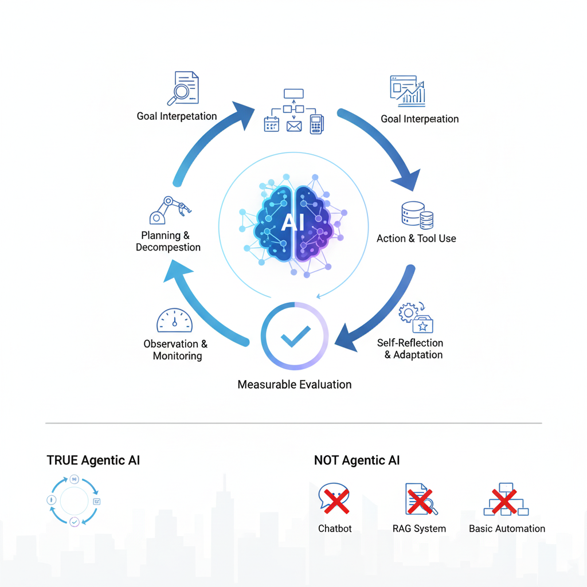
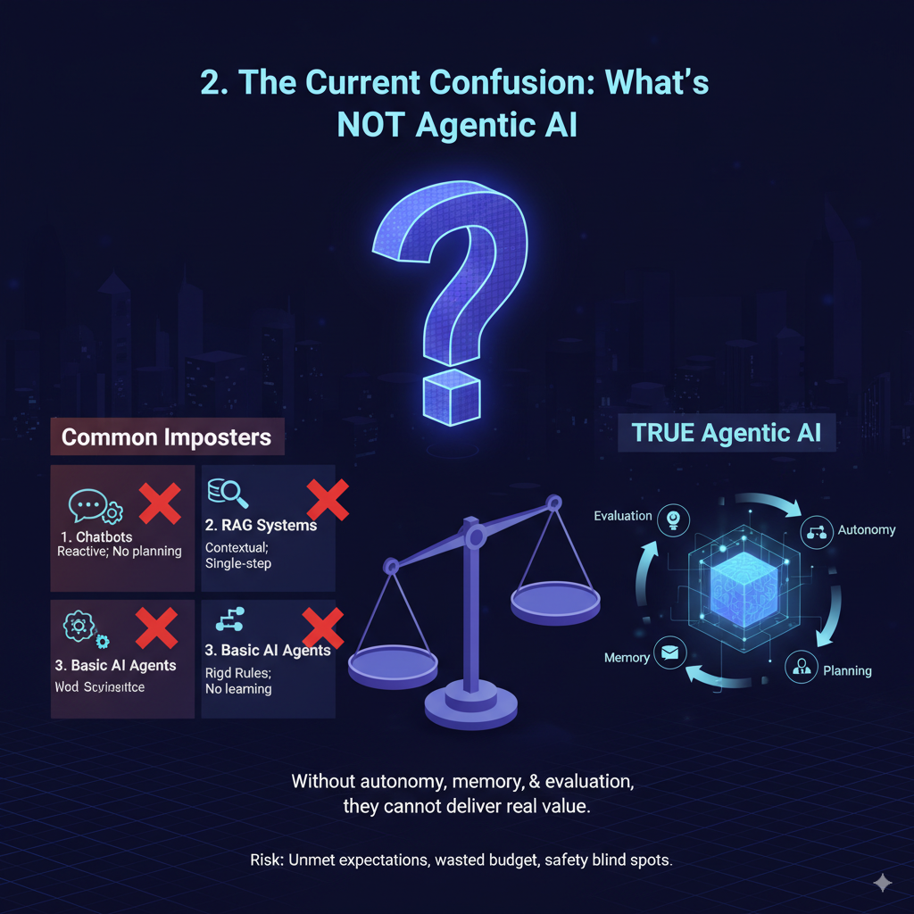
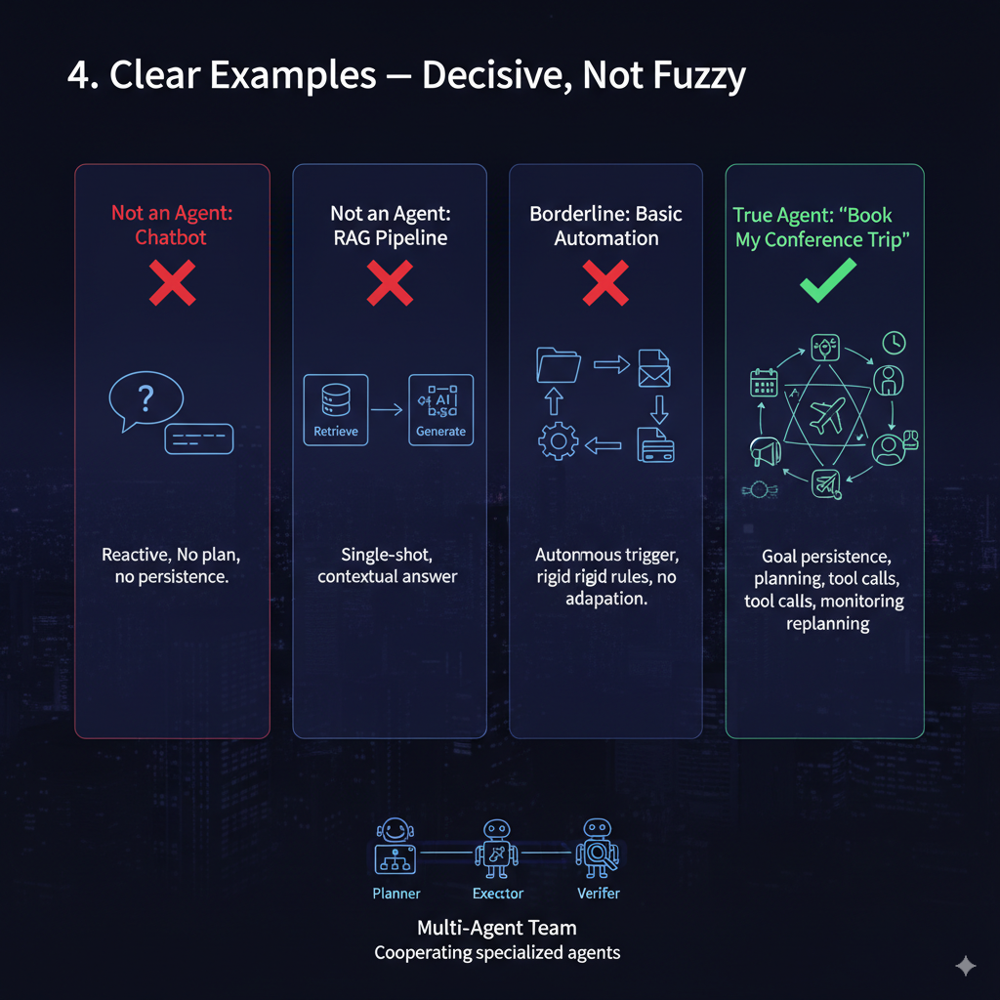

# Agentic AI Dilemma — Decode the Meaning for Value Creation
 
People call many things “AI agents” today. That causes confusion. This short guide explains, in simple terms, when a system is truly an AI agent, how to check claims, what a real agent needs to look like, and what safety steps to take.

Many LLM + tool calling systems are labeled ‘agentic’ without clear evaluation. “An agent without metrics is little more than a toy built from LLM calls. Evaluation-first thinking separates real value from hype.
---

## 1. What is Actually Agentic AI?

Agentic AI refers to autonomous AI systems with agency – meaning they can understand goals and take independent action toward them. Unlike a simple chatbot or LLM API calls, an agentic system doesn’t just wait for prompts; it thinks, plans, acts and adapts over time. 

**Central to Agentic AI is measurable evaluation:** every plan, action, and adaptation must be testable and observable. Without that, claims of autonomy are unverified. In short: an agent without evaluations is a collection of LLM calls, not a production system.

In practice, agentic AI agents have a feedback loop to:
1. interpret high-level objectives
2. decompose them into tasks
3. execute actions (often using external tools or APIs)
4. and continually monitor and refine their progress. 

Think of an agent as a small project manager: it accepts goals, forms strategies, and carries out complex tasks while recording what worked and what didn’t. **Key attributes:** evaluations, autonomy, persistence, planning, execution, observation, adaptation, tool-use, memory.

## 2. The Current Confusion: What's NOT Agentic AI

Many systems are labeled “agentic” but are not. These tools are useful, but they are stepping stones — without autonomy, memory, and evaluation they cannot deliver the real, sustained value businesses expect.

### Common imposters:

#### 1. **Chatbots**
- **Why not:** Mostly reactive and rule- or prompt-driven; they wait for each user input.
- **What they lack:** No true planning, no long-term goal persistence, no autonomous decisions.
- **Role:** Good for structured dialog and basic help, not for autonomous tasks.

#### 2. **RAG (Retrieval-Augmented Generation) Systems**
- **Why not:** Great at adding context but essentially do one retrieve → one generate step.
- **What they lack:** Strategy, ongoing adaptation, and persistent goal pursuit.
- **Role:** Tool for agents (to fetch facts), not an agent by itself.

#### 3. **Basic AI Agents (LLM Calls + Tools Loop)**
- **Why not:** May call tools or run scripts but often follow rigid rules.
- **What they lack:** Built-in evaluation, continuous learning, and adaptive strategy formation.
- **Role:** Task automation and workflow execution, but without true autonomy

If teams confuse these with agents, they risk unmet expectations, wasted budget, and safety blind spots.

---

## 3. The 1–minute litmus test (apply this to any product)

Ask these 8 yes/no questions. If 5 or more are YES, the system is likely agentic. If fewer than 5 are YES, it is not.

1. **Goal persistence:** Can it keep working toward a high-level goal across multiple steps/time without new prompts?
2. **Autonomous planning:** Does it generate its own multi-step plan (task decomposition), not just run a script?
3. **Actionable tool use:** Can it call external tools/APIs to produce side-effects (send email, write DB, book ticket)?
4. **Observation & monitoring:** After actions, does it inspect results and use them to decide the next step?
5. **Memory:** Does it store and later retrieve outcomes/preferences to influence future behavior?
6. **Evaluation metrics defined (success criteria, KPIs):** If the system does not measure its own performance or share those metrics, it is unlikely a real agent."
7. **Self-evaluation/replanning:** Can it detect failure or suboptimality and automatically replan or retry?
8. **Learning/Adaptation:** Does the system's performance improve over time as it gains more experience?

**Minimum practical agent:** YES to (1),(2),(3),(4),(5),(6).
(7)–(8) separate *robust* agents from fragile ones.

If your vendor cannot demonstrate these abilities in a live demo, you are not buying an agent - you are buying a chatbot or workflow automation with marketing paint.

---

## 4. Clear examples — decisive, not fuzzy

* **Not an agent:** A single-turn chatbot that answers customer questions from a KB.
  *Why:* No plan, no persistence, no side-effects.

* **Not an agent:** A RAG pipeline that retrieves docs and returns a grounded answer.
  *Why:* Retrieval + generation is still single-shot, not an ongoing pursuit of a goal.

* **Borderline (basic automation):** A script watching a folder and converting files.
  *Why:* Autonomous triggers but rigid rules; no planning or adaptation.

* **True agent (practical):** “Book my conference trip” — infers constraints, searches flights, compares prices, books seats, updates calendar, notifies attendees, retries or escalates on failure — all without human micro-instructions.
  *Why:* Goal persistence, planning, tool calls, monitoring, replanning.

* **Multi-agent team:** Planner agent + executor agent + verifier agent on a shared bus, cooperating to deliver a project.
  *Why:* This approach allows for a "division of labor" among specialized agents, leading to more robust and efficient problem-solving. For example, in a software development context, one agent could be responsible for writing code, another for testing, and a third for documentation, all collaborating to complete a project."

---

## 5. The Architecture of Agentic AI - Core Components

True Agentic AI exhibits autonomy, goal-driven behavior and adaptability, operating through a sophisticated interplay of multiple cognitive components - each must be testable.

1. **Goal Understanding and Interpretation:** turns vague input into a concrete brief (like a project manager). i.e: understanding "help me prepare for tomorrow's board meeting" involves inferring presentation needs, data analysis requirements, and strategic recommendations

2. **Dual Memory Architecture:** working memory (current plan) and long-term memory (past outcomes and preferences). i.e: like having sticky notes for today and an archive for past projects.

3. **Multi-Step Reasoning and Planning:** decompose tasks, manage dependencies, and schedule steps (like a project plan) i.e: similar to a project plan with tasks, deadlines, and dependencies. 

4. **Adaptive Execution and Tool Integration** safe, sandboxed connectors to APIs, DBs, email, payment systems; with deterministic validators. i.e: a worker using the right tool for each job and knowing when to switch.

5. **Self-Reflection and Learning Mechanisms** evaluate outcomes, incorporate feedback, and refine strategies (like checking homework)

6. **Goal Persistence and Resilience** resume after interruptions, find alternative paths, iterate until success (like a marathon runner)

7. **Evaluator / Metrics Engine** — built-in metric collection: task completion rate, error rates, latency, tool-use accuracy, cost per decision. Evaluation should feed the planner and drive improvements.

Multi-agent collaboration matters because no single agent can master all domains. Just like in a company, one agent may specialize in planning, another in execution, and another in verification. Together they deliver results that are more reliable and scalable than any single agent working alone.

## 6. Governance & Guardrails** 

Agentic systems act without constant supervision, which makes **safety critical**. Practical guardrails include:

  * **Action whitelists:** Only allow safe external actions (e.g., booking flights, not deleting files).
  * **Human-in-the-loop:** Escalate when high-risk or ambiguous steps are reached.
  * **Audit trails:** Keep logs of every decision, tool call, and plan adjustment.
  * **Validators:** Independent agents that double-check outputs before execution.
  * **Continuous evaluation & monitoring:** Real-time KPI dashboards and alerts for drift or anomalies.

👉 *Without governance, agents may take unexpected actions that harm trust and adoption. With guardrails, they become reliable business partners.*

---

## 7. **How to Test Your Vendor’s “Agent”**

Ask vendors to run a live, unscripted demo in your context. Ask for logs and metrics. Specific requests:

* Can the agent **pursue a goal over time** without constant prompting?
* Does it **replan** if a step fails?
* Can it use **external tools** (e.g., calendar, email, database) to complete tasks?
* Does it have **memory** (remembers your preferences, recalls past sessions)?
* Is there an **audit trail** you can inspect afterward?

👉 If the answer is “no” to most, it’s not an agent — it’s a chatbot or scripted automation.

### Practitioner takeaways (what to do tomorrow)

* **Prompt engineers:** shift from “perfect prompts” to *meta-prompts* that let agents generate inner plans and checks. Design prompts for iteration and critique.
* **Context engineers:** implement explicit memory APIs (write, retrieve, forget), and design relevance filters; don’t treat RAG as a substitute for structured memory.
* **System architects:** build modular planners, validators, and a governance layer first — then integrate LLMs as decision engines. Prioritize observability and rollback.

---

## 8. The Agentic AI Reality Check

**If it plans, acts, checks, and learns — and can audit every step — call it an agent.**
If it only answers, retrieves, or runs prewritten scripts, call it a chatbot, RAG system, or automation. Precision in naming forces the right engineering and safety investments.

📊 Key Metrics for Real Agents:
- Task Completion Rate: % of goals achieved without human intervention
- Adaptation Score: How performance improves over iterations
- Tool Efficiency: Right tool selection rate
- Memory Utilization: % of relevant past experiences applied
- Cost per Autonomous Decision: Economic viability metric

The future belongs not to systems that merely respond to prompts or retrieve information, but to those that can understand goals, formulate strategies, learn from experience, and autonomously pursue objectives while collaborating with humans and other agents. This is the promise—and the challenge—of Agentic AI.

---

## Further Reading & References

* **Building Effective Agents**
  [Anthropic Research](https://www.anthropic.com/research/building-effective-agents)
  *Anthropic’s perspective on what separates robust agents from fragile tool-callers.*

* **Eval-Driven System Design**
  [OpenAI Cookbook Example](https://cookbook.openai.com/examples/partners/eval_driven_system_design/receipt_inspection)
  *Practical recipe showing how to embed evaluation loops in applied AI systems.*

* **Video Lecture: Agentic AI and Evaluation**
  [Vimeo](https://vimeo.com/1105244173)
  *A recorded talk on designing agentic AI with built-in feedback and oversight.*

* **The Actual Agentic AI**
  [Facebook Post](https://www.facebook.com/photo/?fbid=816018024113093&set=gm.1212824273968740&idorvanity=1022601539657682)
  *Perspective on what separates agents from llm calls.*

* **Eval-Driven Educational Agents (Research Repo)**
  [GitHub – Eval Driven Edu Agents](https://github.com/mjunaidca/eval-driven-edu-agents?tab=readme-ov-file#study-clone-research-for-eval-driven-edu-agents)
  *A hands-on exploration of evaluation-first design applied to educational AI agents.*

---

*This research document represents the current understanding of Agentic AI as of September 2025, synthesizing academic research, industry developments, and practical implementations. As this field rapidly evolves, continuous updates and refinements to these concepts are expected.*
